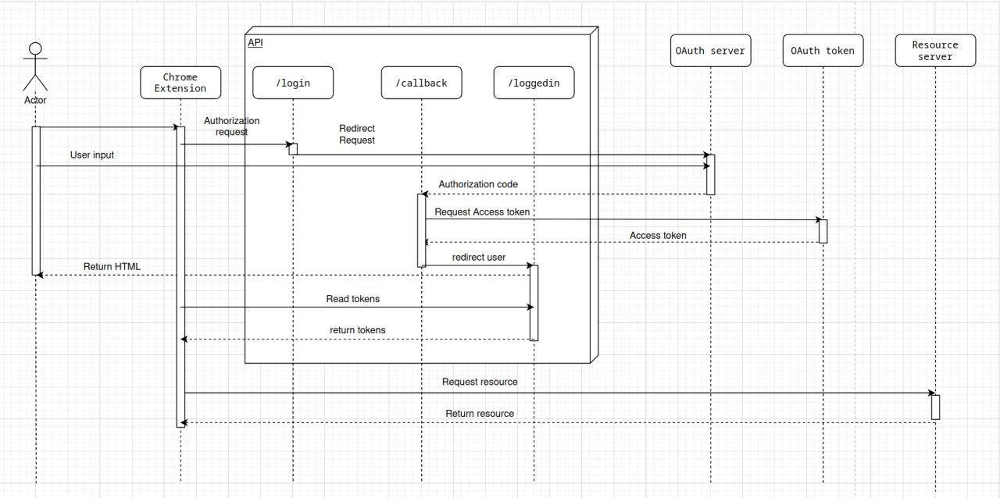

# Sync Chan Server

It is an authorization server for the [Sync Chan](https://github.com/Bharath1910/sync-chan) chrome extension. Handling the OAuth2 authorization workflow.

Sync Chan was supposed to be an chrome extension to easily sync currently watching anime with MyAnimeList. But I recently found out that a similar project already exist [MALSync](https://github.com/MALSync/MALSync). 

Due to it, I decided to stop the development of this project. 

# Authorization Workflow

# Learnings

- Understaning how OAuth2 authorization workflow works
- Improved my knowledge about python flask

---